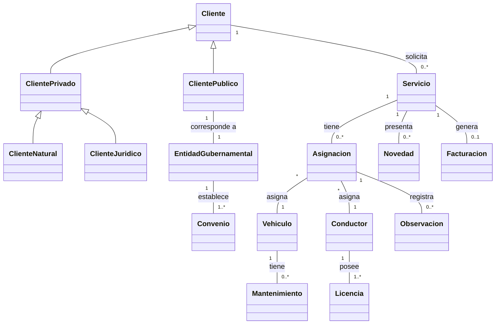
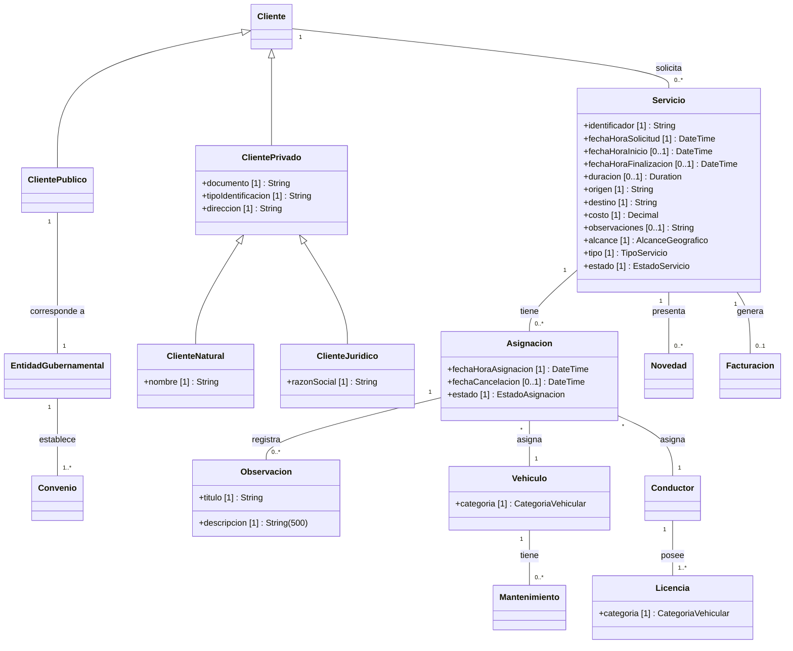

# Parcial Primer Tercio — Grúas Nacionales S.A.S.

## Modelo conceptual inicial (reducido — sin atributos)

Este modelo muestra únicamente **clases y relaciones** (conceptos y cómo se conectan entre sí).

> **Nota sobre EntidadGubernamental:** El enunciado indica que los clientes públicos "corresponden a entidades gubernamentales" y que cada convenio "pertenece exclusivamente a una sola entidad". Se modela `EntidadGubernamental` como clase separada para hacer explícito que los convenios pertenecen a la entidad gubernamental (no directamente al cliente público), y que cada cliente público corresponde a exactamente una entidad gubernamental.

> **Nota sobre herencia:** La jerarquía Cliente → ClientePublico / ClientePrivado es **{disjunta, completa}**: todo cliente es necesariamente público o privado (no mixto) y no existen clientes genéricos sin subtipo. Dentro de ClientePrivado, la jerarquía ClientePrivado → ClienteNatural / ClienteJuridico es también **{disjunta, completa}**: el enunciado indica que los clientes privados "pueden ser personas naturales o jurídicas" con atributos distintos para cada uno (`nombre` vs `razonSocial`).

> **Nota sobre Facturacion:** La relación `Servicio "1" -- "0..1" Facturacion` captura que un servicio puede tener a lo sumo una facturación. Sin embargo, la restricción de que **solo servicios en estado finalizado** pueden generarla es una regla de negocio (constraint `{estado = finalizado}`) que no se puede expresar únicamente con multiplicidades en el diagrama.

> **Nota sobre Asignacion:** Conceptualmente actúa como una **clase de asociación** que vincula Servicio, Vehiculo y Conductor. Mermaid no soporta clases de asociación nativamente, por lo que se modela como una clase intermedia conectada a las tres entidades.

Los dos conceptos más relevantes son **Servicio** y **Asignacion**: el primero es la razón de ser del negocio y conecta clientes con la operación; el segundo es el mecanismo que habilita la ejecución del servicio vinculando recursos (vehículo y conductor).

---

### Definición del concepto más importante: Servicio

**Servicio** representa la unidad operativa fundamental del negocio de Grúas Nacionales S.A.S. Es el registro de una solicitud de grúa o asistencia vehicular realizada por un cliente, que tiene un origen y destino geográficos, un alcance (urbano, intermunicipal o nacional), un tipo (inmovilización, traslado o custodia) y un ciclo de vida definido por sus estados (solicitado → asignado → en proceso → finalizado / cancelado).

**Justificación:**

1. Toda la actividad del negocio gira en torno a la prestación de servicios de grúa.
2. Conecta directamente con clientes (quienes lo solicitan), vehículos y conductores (quienes lo ejecutan a través de la asignación).
3. Su estado determina la facturabilidad y la trazabilidad operativa (novedades, observaciones).
4. Es el concepto con mayor cantidad de relaciones y reglas de negocio asociadas.

---

### Consulta gerencial más relevante

**COMO** gerente de operaciones de Grúas Nacionales S.A.S.
**QUIERO** conocer el total de ingresos por servicios finalizados, agrupados por tipo de servicio y alcance geográfico, en un periodo determinado
**PARA PODER** identificar las líneas de negocio más rentables y tomar decisiones estratégicas sobre inversión en flota, expansión territorial y negociación de convenios.

#### Detalle del reporte

| Columna | Descripción |
|---|---|
| Tipo de servicio | Clasificación: Inmovilización, Traslado o Custodia |
| Alcance geográfico | Clasificación: Urbano, Intermunicipal o Nacional |
| Cantidad de servicios | Número de servicios finalizados en el periodo |
| Ingreso total | Suma de los costos de los servicios finalizados |
| Periodo consultado | Rango de fechas seleccionado por el usuario |

**Justificación:** Esta consulta permite a la gerencia evaluar el desempeño comercial por segmento de operación. Al cruzar tipo de servicio con alcance geográfico, se identifican combinaciones rentables (ej.: traslados nacionales vs. inmovilizaciones urbanas), lo que orienta decisiones de inversión en flota especializada y expansión de cobertura.

---

## Modelo conceptual extendido — Servicios y Asignaciones (con atributos, tipos y reglas de negocio)

Se incorporan atributos y reglas de negocio exclusivamente para las clases detalladas en las secciones SERVICIOS y ASIGNACIONES del enunciado. Las demás clases se mantienen sin atributos.

### Reglas de negocio modeladas

1. **Formato de identificador** → `identificador [1] : String` con restricción de formato `S-####` (ej.: S-0001).
2. **Título de observación único** → `titulo [1] : String` en `Observacion` con restricción `{unique}` dentro de su asignación.
3. **Tipos de servicio fijos** → Enumeración `TipoServicio` con valores Inmovilización, Traslado, Custodia. Expresada como atributo `tipo [1] : TipoServicio`.
4. **Duración derivada** → `duracion [0..1] : Duration` en `Servicio` se calcula como `fechaHoraFinalizacion − fechaHoraInicio`. Restricción: no puede superar una semana. Es `[0..1]` porque no existe hasta que el servicio finaliza.
5. **Observaciones con máximo de 500 caracteres** → `descripcion [1] : String(500)`. La longitud máxima se expresa en el tipo.
6. **Fecha de cancelación nullable** → `fechaCancelacion [0..1] : DateTime`. La opcionalidad se expresa con la cardinalidad `[0..1]` en el atributo. Se registra automáticamente cuando el servicio asociado es cancelado.
7. **Cardinalidad de atributos** → `fechaHoraInicio` y `fechaHoraFinalizacion` son `[0..1]` porque no existen al momento de la solicitud. Los demás atributos obligatorios se marcan `[1]`.
8. **Enumeraciones fuera del diagrama** → Para reducir la carga visual, las cuatro enumeraciones (`AlcanceGeografico`, `TipoServicio`, `EstadoServicio`, `EstadoAsignacion`) se documentan únicamente en la sección de tipos enumerados. Se referencian como tipos en los atributos de `Servicio` y `Asignacion`.

> **Atributo derivado:** `Servicio.duracion` se calcula como `fechaHoraFinalizacion − fechaHoraInicio`. No se almacena directamente; se deriva de los dos atributos de fecha/hora. Mermaid no soporta el prefijo `/` de UML para derivados, por lo que se documenta aquí.

> **Restricciones no expresables en el diagrama:**
> - `Servicio.identificador` debe seguir el formato `S-####` (ej.: S-0001).
> - `Observacion.titulo` debe ser único dentro de su asignación `{unique}`.
> - `Servicio.duracion` no puede superar una semana.
> - Solo servicios con `estado = finalizado` pueden generar `Facturacion`.
> - `Asignacion.fechaCancelacion` se registra automáticamente al cancelar el servicio asociado.
> - No se puede vincular el mismo vehículo ni el mismo conductor a dos servicios simultáneamente.
> - Una asignación solo puede realizarse si el vehículo está disponible y el conductor habilitado con licencia vigente.
> - En una asignación, `Licencia.categoria` del conductor debe corresponder a `Vehiculo.categoria` del vehículo asignado.

> **Cardinalidades en atributos:** La notación `[1]` indica atributo obligatorio, `[0..1]` indica atributo opcional (nullable). `fechaHoraInicio`, `fechaHoraFinalizacion` y `duracion` son `[0..1]` porque no existen al momento de la solicitud; se completan conforme avanza el ciclo de vida del servicio. `String(500)` indica longitud máxima de 500 caracteres.

### Tipos enumerados

#### `EstadoServicio`

Controla el ciclo de vida del servicio y determina qué operaciones son válidas en cada fase.

| Valor | Descripción |
|---|---|
| `solicitado` | Estado inicial. El cliente ha solicitado el servicio pero aún no se asignan recursos. |
| `asignado` | Se ha vinculado un vehículo disponible y un conductor habilitado mediante una asignación. |
| `enProceso` | El servicio está en ejecución. Durante esta fase pueden registrarse novedades. |
| `finalizado` | El servicio concluyó exitosamente. **Único estado que permite generar facturación.** |
| `cancelado` | El servicio fue cancelado. La asignación asociada se libera automáticamente y se registra la fecha de cancelación. |

#### `EstadoAsignacion`

Gobierna la disponibilidad de recursos (vehículo y conductor) vinculados a un servicio.

| Valor | Descripción |
|---|---|
| `pendiente` | La asignación fue creada pero aún no está activa. |
| `activa` | El vehículo y el conductor están comprometidos con el servicio. No pueden asignarse a otro servicio simultáneamente. |
| `cancelada` | La asignación fue liberada (por cancelación del servicio). Se registra `fechaCancelacion` automáticamente. |
| `completada` | La asignación finalizó exitosamente junto con el servicio. |

#### `TipoServicio`

Clasifica el servicio según la naturaleza de la operación solicitada por el cliente.

| Valor | Descripción |
|---|---|
| `inmovilizacion` | Retiro e inmovilización de un vehículo por orden de autoridad u otra causa. |
| `traslado` | Transporte de un vehículo de un punto de origen a un destino. |
| `custodia` | Resguardo temporal de un vehículo en instalaciones de la empresa. |

#### `AlcanceGeografico`

Clasifica el servicio según su cobertura territorial, lo que puede incidir en el costo y la disponibilidad de recursos.

| Valor | Descripción |
|---|---|
| `urbano` | Servicio dentro de una misma ciudad o área metropolitana. |
| `intermunicipal` | Servicio entre municipios dentro de un mismo departamento o región. |
| `nacional` | Servicio entre departamentos o con cobertura a nivel país. |

#### `CategoriaVehicular`

Clasifica vehículos y licencias según la categoría vehicular. La asignación requiere que la categoría de la licencia del conductor corresponda a la del vehículo.

| Valor | Descripción |
|---|---|
| `liviano` | Vehículos livianos (automóviles, camionetas). |
| `pesado` | Vehículos pesados (camiones, tractomulas). |
| `especial` | Vehículos especiales (maquinaria, transporte excepcional). |

---

## Supuestos explícitos

- **EntidadGubernamental como clase separada:** Aunque la relación entre ClientePublico y EntidadGubernamental es 1 a 1, se modelan como clases distintas porque el enunciado las presenta como conceptos diferenciables: el cliente público es quien solicita servicios, mientras que la entidad gubernamental es la organización a la que pertenecen los convenios. Esta separación permite expresar con claridad que los convenios se establecen a nivel de la entidad, no del cliente individual.

- **ClienteNatural y ClienteJuridico como subclases de ClientePrivado:** El enunciado dice que los clientes privados "pueden ser personas naturales o jurídicas" y asigna atributos condicionales distintos: `nombre` (si es persona natural) y `razonSocial` (si es persona jurídica). Se modela como una segunda jerarquía {disjunta, completa} bajo `ClientePrivado`, donde los atributos comunes (`documento`, `tipoIdentificacion`, `direccion`) permanecen en la superclase. Alternativa válida: mantener todo en `ClientePrivado` con atributos opcionales y una restricción externa.

- **Conductor como entidad independiente:** El enunciado menciona conductores en el contexto de asignaciones y licencias, pero no los describe en una sección dedicada. Se asume que Conductor es una entidad del dominio con identidad propia (nombre, datos de contacto, estado habilitado/inhabilitado).

- **Licencia como entidad separada:** Se modela Licencia como entidad independiente de Conductor porque el enunciado indica que debe corresponder a la categoría del vehículo y estar vigente, lo que implica atributos propios (categoría, fecha de vencimiento). Un conductor puede poseer una o varias licencias (una por categoría vehicular).

- **Novedad vs. Observación:** Se modelan como conceptos distintos. Las **novedades** son eventos que ocurren durante la ejecución de un servicio (sección SERVICIOS: "pueden presentarse novedades"). Las **observaciones** son registros estructurados (título y descripción) del conductor dentro de una asignación (sección ASIGNACIONES: "observaciones (título y descripción) del conductor").

- **Multiplicidad Servicio–Asignacion (1 a 0..*):** Se asume que un servicio puede tener múltiples asignaciones a lo largo del tiempo (ej.: si una asignación se cancela y se crea una nueva con otro vehículo/conductor). En un momento dado, solo una asignación puede estar activa por servicio.

- **Facturación como entidad separada:** El enunciado establece que "únicamente los servicios en estado finalizado pueden generar facturación". Se modela `Facturacion` como entidad independiente relacionada con Servicio (multiplicidad `0..1`: un servicio finalizado puede generar a lo sumo una facturación, y un servicio no finalizado no genera ninguna). La restricción de que solo servicios finalizados generan facturación es una regla de negocio que se documenta como constraint, ya que no es expresable solo con multiplicidades.

- **`observaciones` en Servicio como atributo de texto:** La sección SERVICIOS lista "observaciones" entre los datos registrados del servicio. Se modela como atributo de texto simple (`String`) en `Servicio`, distinto de la entidad `Observacion` (título + descripción) que pertenece a `Asignacion`.

- **Unicidad de título de Observacion por asignación:** La regla dice que "el título de cada observación de la asignación debe ser único". Se interpreta como unicidad dentro del alcance de una asignación (no global del sistema), ya que el enunciado dice "de la asignación".

- **Duración como Duration:** Se usa el tipo `Duration` (no `int` ni `Decimal`) para representar la duración del servicio, ya que se calcula como diferencia entre dos `DateTime` y debe validarse contra el máximo de una semana.

- **Valores de CategoriaVehicular:** El enunciado menciona "la categoría del vehículo" sin especificar los valores concretos. Se asumen tres categorías razonables (`liviano`, `pesado`, `especial`) como interpretación didáctica. En un caso real, estos valores se obtendrían de la normativa de tránsito aplicable.

- **Mantenimiento como entidad separada:** El enunciado menciona "en mantenimiento" como estado operativo del vehículo. Se modela Mantenimiento como entidad independiente porque un vehículo puede tener múltiples mantenimientos a lo largo del tiempo, cada uno con identidad propia (fechas, tipo, estado). El estado "en mantenimiento" del vehículo se deriva de la existencia de un mantenimiento activo asociado.

---

## Sugerencia de uso en clase

1. **Identificar conceptos faltantes:** Proyectar solo la descripción textual y pedir a los estudiantes que listen todas las entidades antes de ver el diagrama. Comparar con el modelo propuesto y discutir decisiones como separar Novedad de Observación.

2. **Discutir la Asignación como clase de asociación:** Usar el modelo para explicar el patrón de clase de asociación ternaria (Servicio–Vehículo–Conductor) y cómo se resuelve en herramientas que no soportan asociaciones ternarias nativamente.

3. **Validar multiplicidades:** Pedir a los estudiantes que justifiquen cada multiplicidad con fragmentos del enunciado. Esto refuerza la lectura crítica de requerimientos y la traducción a restricciones del modelo.
