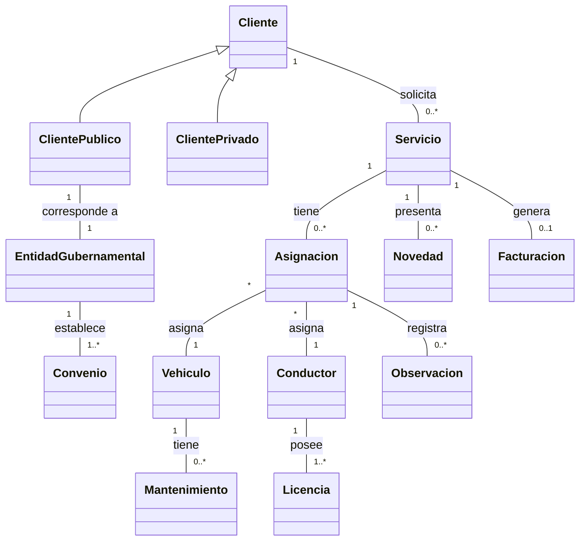

# Parcial Primer Tercio — Grúas Nacionales S.A.S.

## Modelo conceptual inicial (reducido — sin atributos)

Este modelo muestra únicamente **clases y relaciones** (conceptos y cómo se conectan entre sí).

> **Nota sobre EntidadGubernamental:** El enunciado indica que los clientes públicos "corresponden a entidades gubernamentales" y que cada convenio "pertenece exclusivamente a una sola entidad". Se modela `EntidadGubernamental` como clase separada para hacer explícito que los convenios pertenecen a la entidad gubernamental (no directamente al cliente público), y que cada cliente público corresponde a exactamente una entidad gubernamental.

> **Nota sobre herencia:** La jerarquía Cliente → ClientePublico / ClientePrivado es **{disjunta, completa}**: todo cliente es necesariamente público o privado (no mixto) y no existen clientes genéricos sin subtipo.

> **Nota sobre Facturacion:** La relación `Servicio "1" -- "0..1" Facturacion` captura que un servicio puede tener a lo sumo una facturación. Sin embargo, la restricción de que **solo servicios en estado finalizado** pueden generarla es una regla de negocio (constraint `{estado = finalizado}`) que no se puede expresar únicamente con multiplicidades en el diagrama.

> **Nota sobre Asignacion:** Conceptualmente actúa como una **clase de asociación** que vincula Servicio, Vehiculo y Conductor. Mermaid no soporta clases de asociación nativamente, por lo que se modela como una clase intermedia conectada a las tres entidades.

Los dos conceptos más relevantes son **Servicio** y **Asignacion**: el primero es la razón de ser del negocio y conecta clientes con la operación; el segundo es el mecanismo que habilita la ejecución del servicio vinculando recursos (vehículo y conductor).

---

### Definición del concepto más importante: Servicio

**Servicio** representa la unidad operativa fundamental del negocio de Grúas Nacionales S.A.S. Es el registro de una solicitud de grúa o asistencia vehicular realizada por un cliente, que tiene un origen y destino geográficos, un alcance (urbano, intermunicipal o nacional), un tipo (inmovilización, traslado o custodia) y un ciclo de vida definido por sus estados (solicitado → asignado → en proceso → finalizado / cancelado).

**Justificación:**

1. Toda la actividad del negocio gira en torno a la prestación de servicios de grúa.
2. Conecta directamente con clientes (quienes lo solicitan), vehículos y conductores (quienes lo ejecutan a través de la asignación).
3. Su estado determina la facturabilidad y la trazabilidad operativa (novedades, observaciones).
4. Es el concepto con mayor cantidad de relaciones y reglas de negocio asociadas.

---

### Consulta gerencial más relevante

**COMO** gerente de operaciones de Grúas Nacionales S.A.S.
**QUIERO** conocer el total de ingresos por servicios finalizados, agrupados por tipo de servicio y alcance geográfico, en un periodo determinado
**PARA PODER** identificar las líneas de negocio más rentables y tomar decisiones estratégicas sobre inversión en flota, expansión territorial y negociación de convenios.

#### Detalle del reporte

| Columna | Descripción |
|---|---|
| Tipo de servicio | Clasificación: Inmovilización, Traslado o Custodia |
| Alcance geográfico | Clasificación: Urbano, Intermunicipal o Nacional |
| Cantidad de servicios | Número de servicios finalizados en el periodo |
| Ingreso total | Suma de los costos de los servicios finalizados |
| Periodo consultado | Rango de fechas seleccionado por el usuario |

**Justificación:** Esta consulta permite a la gerencia evaluar el desempeño comercial por segmento de operación. Al cruzar tipo de servicio con alcance geográfico, se identifican combinaciones rentables (ej.: traslados nacionales vs. inmovilizaciones urbanas), lo que orienta decisiones de inversión en flota especializada y expansión de cobertura.

---

## Supuestos explícitos

- **EntidadGubernamental como clase separada:** Aunque la relación entre ClientePublico y EntidadGubernamental es 1 a 1, se modelan como clases distintas porque el enunciado las presenta como conceptos diferenciables: el cliente público es quien solicita servicios, mientras que la entidad gubernamental es la organización a la que pertenecen los convenios. Esta separación permite expresar con claridad que los convenios se establecen a nivel de la entidad, no del cliente individual.

- **Conductor como entidad independiente:** El enunciado menciona conductores en el contexto de asignaciones y licencias, pero no los describe en una sección dedicada. Se asume que Conductor es una entidad del dominio con identidad propia (nombre, datos de contacto, estado habilitado/inhabilitado).

- **Licencia como entidad separada:** Se modela Licencia como entidad independiente de Conductor porque el enunciado indica que debe corresponder a la categoría del vehículo y estar vigente, lo que implica atributos propios (categoría, fecha de vencimiento). Un conductor puede poseer una o varias licencias (una por categoría vehicular).

- **Novedad vs. Observación:** Se modelan como conceptos distintos. Las **novedades** son eventos que ocurren durante la ejecución de un servicio (sección SERVICIOS: "pueden presentarse novedades"). Las **observaciones** son registros estructurados (título y descripción) del conductor dentro de una asignación (sección ASIGNACIONES: "observaciones (título y descripción) del conductor").

- **Multiplicidad Servicio–Asignacion (1 a 0..*):** Se asume que un servicio puede tener múltiples asignaciones a lo largo del tiempo (ej.: si una asignación se cancela y se crea una nueva con otro vehículo/conductor). En un momento dado, solo una asignación puede estar activa por servicio.

- **Facturación como entidad separada:** El enunciado establece que "únicamente los servicios en estado finalizado pueden generar facturación". Se modela `Facturacion` como entidad independiente relacionada con Servicio (multiplicidad `0..1`: un servicio finalizado puede generar a lo sumo una facturación, y un servicio no finalizado no genera ninguna). La restricción de que solo servicios finalizados generan facturación es una regla de negocio que se documenta como constraint, ya que no es expresable solo con multiplicidades.

- **Mantenimiento como entidad separada:** El enunciado menciona "en mantenimiento" como estado operativo del vehículo. Se modela Mantenimiento como entidad independiente porque un vehículo puede tener múltiples mantenimientos a lo largo del tiempo, cada uno con identidad propia (fechas, tipo, estado). El estado "en mantenimiento" del vehículo se deriva de la existencia de un mantenimiento activo asociado.

---

## Sugerencia de uso en clase

1. **Identificar conceptos faltantes:** Proyectar solo la descripción textual y pedir a los estudiantes que listen todas las entidades antes de ver el diagrama. Comparar con el modelo propuesto y discutir decisiones como separar Novedad de Observación.

2. **Discutir la Asignación como clase de asociación:** Usar el modelo para explicar el patrón de clase de asociación ternaria (Servicio–Vehículo–Conductor) y cómo se resuelve en herramientas que no soportan asociaciones ternarias nativamente.

3. **Validar multiplicidades:** Pedir a los estudiantes que justifiquen cada multiplicidad con fragmentos del enunciado. Esto refuerza la lectura crítica de requerimientos y la traducción a restricciones del modelo.
