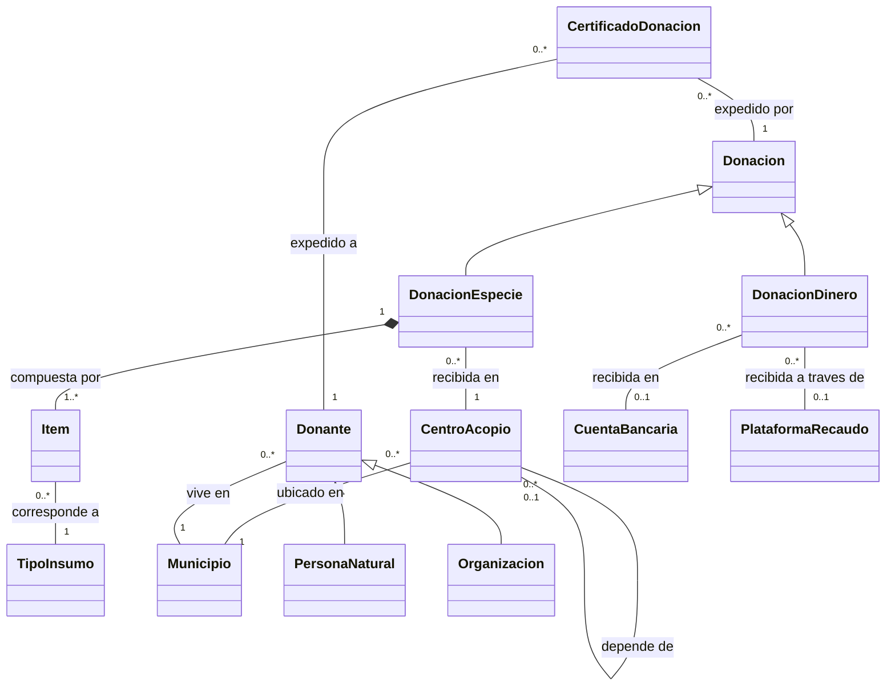
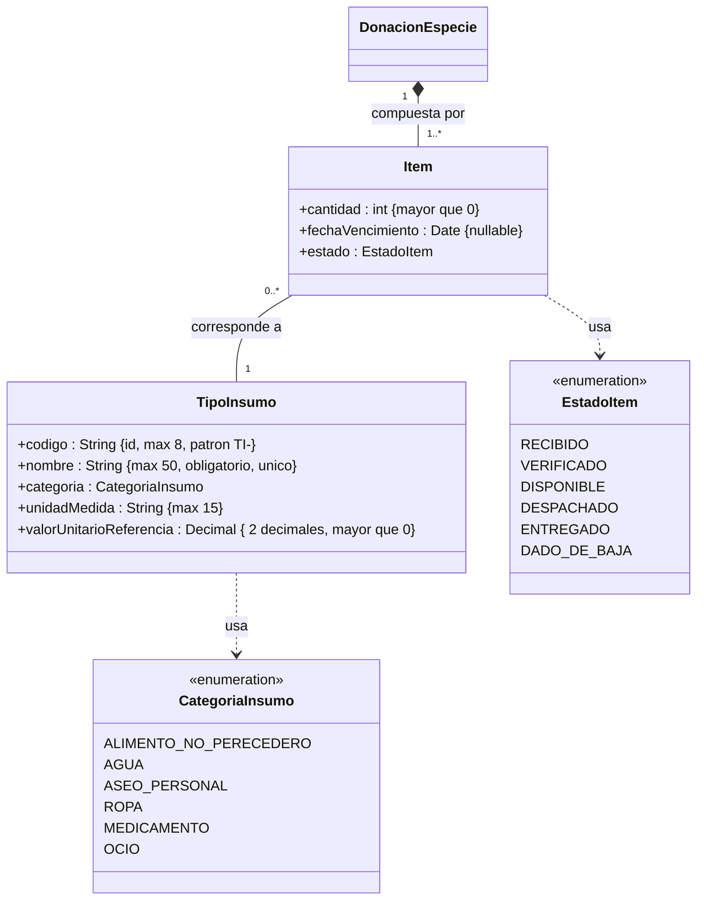

# Parcial Primer Tercio — Fundacion Puente Solidario

## Modelo conceptual inicial (reducido — sin atributos)

Este modelo muestra unicamente **clases y relaciones** del dominio de la Fundacion Puente Solidario, una organizacion sin animo de lucro que conecta donantes con quienes necesitan ayuda, haciendo seguimiento a cada donacion.



> **Nota sobre clases de asociacion:** `CertificadoDonacion` modela la clase de asociacion entre `Donante` y `Donacion`. En UML puro seria una clase de asociacion sobre la relacion muchos-a-muchos "realiza". En Mermaid se representa como clase intermedia conectada a ambos extremos. El certificado se expide por cada donante que participa en una donacion verificada.

> **Nota sobre restriccion XOR:** `DonacionDinero` se recibe en una `CuentaBancaria` **o** a traves de una `PlataformaRecaudo`, pero **nunca de las dos formas**. Ambas asociaciones son opcionales (0..1) y se aplica una restriccion {xor} entre ellas.

> **Nota sobre autorelacion:** La relacion `depende de` en `CentroAcopio` modela la jerarquia centro principal / centro satelite. Un centro puede depender de un centro principal (0..1), y un centro principal coordina cero o muchos centros satelite.

### Conceptos mas relevantes

Los dos conceptos mas relevantes del modelo son:

1. **Donacion** — Es el concepto central del dominio. Todo el sistema gira alrededor de rastrear donaciones: conecta donantes con la fundacion, se especializa en dinero o especie, genera certificados y, en el caso de especie, agrupa los items recibidos en centros de acopio. Sin donacion no existe razon de ser para el sistema.

2. **CertificadoDonacion** — Materializa la relacion muchos-a-muchos entre donantes y donaciones, capturando la participacion verificada. Es clave porque representa el vinculo formal entre el donante y su aporte, y es el mecanismo de transparencia y reconocimiento de la fundacion.

---

## Definicion del concepto mas importante

**Donacion**

Una donacion representa el acto mediante el cual uno o varios donantes aportan recursos a la Fundacion Puente Solidario. Cada donacion tiene un numero identificador, una fecha y hora de recepcion y un estado. Toda donacion es obligatoriamente de uno de dos tipos excluyentes: donacion en dinero (con monto y moneda, recibida a traves de una cuenta bancaria o una plataforma de recaudo) o donacion en especie (compuesta por uno o mas items concretos, recibida en un centro de acopio).

**Justificacion:** Donacion es el concepto mas importante porque:
- Es el **eje central** del sistema: la mision de la fundacion es conectar donantes con necesitados, y la donacion es el vehiculo de esa conexion.
- **Articula las dos jerarquias principales**: vincula donantes (personas naturales u organizaciones) con los recursos (items/dinero).
- **Genera certificados**: la participacion verificada de un donante en una donacion produce un certificado, lo cual es fundamental para la transparencia.
- **Todo flujo operativo** (recepcion, verificacion, despacho) depende de que exista una donacion registrada.

---

## Consulta gerencial mas relevante

### Historia de uso

**COMO** director ejecutivo de la Fundacion Puente Solidario,
**QUIERO** conocer el valor total estimado de las donaciones recibidas por municipio y por categoria de insumo en un periodo de tiempo,
**PARA PODER** tomar decisiones estrategicas sobre la apertura o cierre de centros de acopio y focalizar las campanas de donacion en las categorias con mayor deficit.

### Detalle del reporte

| Columna | Descripcion |
|---|---|
| **Municipio** | Nombre del municipio donde esta ubicado el centro de acopio que recibio la donacion |
| **Departamento** | Departamento al que pertenece el municipio |
| **Categoria de insumo** | Categoria del tipo de insumo (alimento no perecedero, agua, aseo personal, ropa, medicamento, ocio) |
| **Cantidad total de items** | Suma de las cantidades de todos los items recibidos en ese municipio y categoria |
| **Valor total estimado** | Suma de (cantidad x valor unitario de referencia) de cada item, agrupado por municipio y categoria |
| **Numero de donaciones** | Cantidad de donaciones en especie distintas que aportaron items de esa categoria en ese municipio |
| **Periodo** | Rango de fechas consultado (parametro de entrada) |

**Justificacion:** Esta consulta es gerencial porque permite a la direccion visualizar **donde se concentra la ayuda y en que categorias**, identificar municipios desatendidos, y redirigir esfuerzos de las campanas hacia las categorias con menor cobertura. No es una consulta operativa del dia a dia, sino una herramienta de **planeacion estrategica**.

---

## Supuestos explicitos

- **Certificado como clase de asociacion:** El enunciado dice que se expide un certificado "por cada donante que participa en una donacion verificada". Se modelo como clase intermedia entre Donante y Donacion, asumiendo que un certificado se identifica por la combinacion unica de donante y donacion.
- **XOR en DonacionDinero:** Se asume que toda donacion en dinero debe estar asociada a exactamente una cuenta bancaria o exactamente una plataforma de recaudo (nunca ambas, nunca ninguna), conforme al enunciado.
- **Composicion Item-DonacionEspecie:** El enunciado establece que "un item donado no tiene ninguna razon de existir por fuera de la donacion en la que llego", lo cual se modela como composicion (rombo relleno).
- **Municipio como clase independiente:** Dado que multiples entidades (CentroAcopio, Donante) referencian al municipio y este tiene atributos propios (codigo DANE, nombre, departamento), se modelo como clase independiente en lugar de atributo simple.
- **Autorelacion en CentroAcopio:** Se asume que un centro puede ser principal (coordinar satelites) y a la vez no depender de nadie, o ser satelite de otro centro. No se restringe la profundidad de la jerarquia (un satelite podria a su vez coordinar otros, aunque en la practica seria un solo nivel).

---

## Modelo conceptual extendido: INSUMOS (con atributos, tipos y reglas de negocio)

Se incorporan las reglas de negocio del enunciado para la seccion de Insumos:

1. **Codigo como identificador** → Atributo `codigo : String {id, max 8, patron "TI-"}` en `TipoInsumo`. Es la llave primaria, cadena de maximo 8 caracteres que inicia con "TI-".
2. **Nombre obligatorio y unico** → Atributo `nombre : String {max 50, obligatorio, unico}` en `TipoInsumo`. Restriccion de unicidad a nivel de sistema.
3. **Categoria enumerada** → Enumeracion `CategoriaInsumo` con 6 valores fijos. `TipoInsumo` depende de esta enumeracion.
4. **Unidad de medida** → Atributo `unidadMedida : String {max 15}` en `TipoInsumo` (ej: kg, litro, unidad, paquete, caja).
5. **Valor unitario de referencia** → Atributo `valorUnitarioReferencia : Decimal {2 decimales, > 0}` en `TipoInsumo`. Debe ser mayor que cero.
6. **Cantidad mayor que cero** → Atributo `cantidad : int {> 0}` en `Item`. Entero positivo obligatorio.
7. **Fecha de vencimiento condicional** → Atributo `fechaVencimiento : Date {nullable}` en `Item`. Solo tiene sentido semantico cuando la categoria del tipo de insumo asociado es alimento no perecedero, agua o medicamento. Es una restriccion semantica, no estructural.
8. **Estado enumerado del item** → Enumeracion `EstadoItem` con 6 valores que representan el ciclo de vida del item. `Item` depende de esta enumeracion.
9. **Item corresponde a un tipo de insumo** → Asociacion `Item "0..*" -- "1" TipoInsumo` (un item tiene exactamente un tipo; un tipo puede tener cero o muchos items).
10. **Item pertenece a una donacion en especie** → Composicion `DonacionEspecie "1" *-- "1..*" Item` (un item no existe sin su donacion; una donacion en especie tiene al menos un item).



> **Restriccion semantica (regla 7):** La fecha de vencimiento (`fechaVencimiento`) solo tiene sentido cuando el `TipoInsumo` asociado al item pertenece a las categorias `ALIMENTO_NO_PERECEDERO`, `AGUA` o `MEDICAMENTO`. Para las categorias `ROPA`, `ASEO_PERSONAL` y `OCIO`, este campo deberia ser nulo. Esta restriccion es semantica (validada por logica de negocio), no estructural (no se puede expresar solo con el diagrama de clases).

### Tipos mas relevantes introducidos

| Tipo | Por que es relevante |
|---|---|
| **`CategoriaInsumo`** (enum) | Define las 6 categorias fijas de insumos que maneja la fundacion. Condiciona la restriccion semantica de la fecha de vencimiento y permite clasificar las donaciones en especie para reportes gerenciales. |
| **`EstadoItem`** (enum) | Representa el ciclo de vida completo de un item dentro de la fundacion (recibido → verificado → disponible → despachado → entregado / dado de baja). Es fundamental para la trazabilidad que es el objetivo principal del sistema. |

### Supuestos del modelo extendido (INSUMOS)

- **Item sin identificador propio explicito:** El enunciado no menciona un codigo o identificador para Item. Se asume que su identidad depende de la donacion en especie a la que pertenece (identificacion por composicion) o que el sistema genera un identificador interno automaticamente.
- **DonacionEspecie sin atributos en este alcance:** Se incluye `DonacionEspecie` solo como referencia para la composicion con `Item`, sin detallar sus atributos porque no pertenece a la seccion INSUMOS.
- **Categoria como enumeracion y no como clase:** Dado que el enunciado lista valores fijos ("alimento no perecedero, agua, aseo personal, ropa, medicamento, ocio") sin atributos adicionales por categoria, se modela como enumeracion. Si en el futuro se necesitaran atributos por categoria (ej: requiereRefrigeracion), seria necesario promoverla a clase.

---

## Consultas sobre el modelo logico antiguo

El parcial proporciona el siguiente modelo logico de una base de datos antigua:

```
BENEFICIARIO (idBeneficiario, nombre, documento, telefono, municipio)
ENTREGA (idEntrega, idBeneficiario, fechaEntrega, lugarEntrega, responsable)
DETALLE_ENTREGA (idDetalle, idEntrega, insumoEntregado, cantidadEntregada, valorEstimado)
```

- `ENTREGA.idBeneficiario` es FK que referencia `BENEFICIARIO.idBeneficiario`
- `DETALLE_ENTREGA.idEntrega` es FK que referencia `ENTREGA.idEntrega`

---

### Consulta 1

> Listar el nombre del beneficiario y la fecha de entrega de las entregas realizadas en el municipio "Bogota", ordenadas por fecha de entrega de manera descendente.

#### Algebra relacional

> **Nota:** El algebra relacional pura no incluye ordenamiento (ORDER BY). Se presenta la consulta sin orden, y se agrega el operador τ (tau) como extension para el ordenamiento.

**Sin ordenamiento:**

```
π nombre, fechaEntrega ( σ municipio='Bogotá' (BENEFICIARIO ⋈ ENTREGA) )
```

**Paso a paso:**

1. `BENEFICIARIO ⋈ ENTREGA` — Join natural sobre `idBeneficiario` (atributo comun).
2. `σ municipio='Bogotá' (...)` — Seleccionar solo las tuplas cuyo municipio sea "Bogota".
3. `π nombre, fechaEntrega (...)` — Proyectar unicamente el nombre del beneficiario y la fecha de entrega.

**Con extension de ordenamiento (τ):**

```
τ fechaEntrega DESC ( π nombre, fechaEntrega ( σ municipio='Bogotá' (BENEFICIARIO ⋈ ENTREGA) ) )
```

**Alternativa equivalente** (restringir antes de unir — mas eficiente):

```
π nombre, fechaEntrega ( (σ municipio='Bogotá' (BENEFICIARIO)) ⋈ ENTREGA )
```

#### Calculo relacional de tuplas

```
{ b.nombre, e.fechaEntrega | b ∈ BENEFICIARIO ∧ e ∈ ENTREGA
    ∧ b.idBeneficiario = e.idBeneficiario
    ∧ b.municipio = 'Bogotá' }
```

**Lectura:** "El conjunto de tuplas (nombre, fechaEntrega) tales que existe un beneficiario `b` y una entrega `e` donde `b` y `e` estan relacionados por `idBeneficiario` y el municipio del beneficiario es 'Bogota'."

> **Nota:** El calculo relacional de tuplas tampoco incluye ordenamiento. El ordenamiento es una operacion de presentacion que se aplica en SQL.

#### SQL

```sql
SELECT B.nombre, E.fechaEntrega
FROM BENEFICIARIO B
    JOIN ENTREGA E ON B.idBeneficiario = E.idBeneficiario
WHERE B.municipio = 'Bogotá'
ORDER BY E.fechaEntrega DESC;
```

**Alternativa con EXISTS:**

```sql
SELECT B.nombre, E.fechaEntrega
FROM BENEFICIARIO B, ENTREGA E
WHERE B.idBeneficiario = E.idBeneficiario
    AND B.municipio = 'Bogotá'
ORDER BY E.fechaEntrega DESC;
```

---

### Consulta 2

> Obtener el valor total estimado entregado a cada beneficiario, considerando unicamente los detalles con cantidad entregada mayor a 0, y mostrar solo aquellos beneficiarios cuyo valor total supere $100.000.

#### SQL

```sql
SELECT B.idBeneficiario, B.nombre, SUM(DE.valorEstimado) AS valorTotalEstimado
FROM BENEFICIARIO B
    JOIN ENTREGA E ON B.idBeneficiario = E.idBeneficiario
    JOIN DETALLE_ENTREGA DE ON E.idEntrega = DE.idEntrega
WHERE DE.cantidadEntregada > 0
GROUP BY B.idBeneficiario, B.nombre
HAVING SUM(DE.valorEstimado) > 100000;
```

**Explicacion paso a paso:**

1. `JOIN ENTREGA E ON B.idBeneficiario = E.idBeneficiario` — Une beneficiarios con sus entregas.
2. `JOIN DETALLE_ENTREGA DE ON E.idEntrega = DE.idEntrega` — Une cada entrega con sus lineas de detalle.
3. `WHERE DE.cantidadEntregada > 0` — Filtra solo los detalles cuya cantidad entregada sea mayor a cero (antes de agrupar).
4. `GROUP BY B.idBeneficiario, B.nombre` — Agrupa por beneficiario para calcular el total.
5. `SUM(DE.valorEstimado)` — Suma el valor estimado de todos los detalles del beneficiario.
6. `HAVING SUM(DE.valorEstimado) > 100000` — Filtra los grupos cuyo valor total supere $100.000.

> **Nota sobre WHERE vs HAVING:** `WHERE` filtra tuplas individuales **antes** de la agrupacion (se excluyen detalles con cantidad = 0). `HAVING` filtra grupos **despues** de la agrupacion (se excluyen beneficiarios cuyo total no supere el umbral). Es un error comun colocar ambas condiciones en el mismo sitio.
