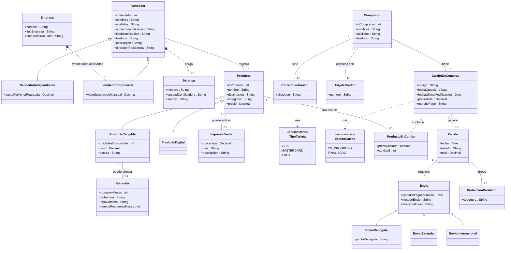

# Modelo de Dominio — Amazon Marketplace
### Material de ejemplo para clase — Diseño Conceptual (Compradores + contexto del dominio)

> **Fuente:** Caso "Amazon Marketplace" (MYSD-TT1-2026-02.pdf). Se modela el dominio completo
> (Vendedores, Productos, Compradores, Pedidos y Envíos) con énfasis en la sección de
> **Compradores**, que es donde se aplican las reglas de negocio extendidas.

---

## 1. Modelo conceptual inicial (reducido — sin atributos)

Este modelo muestra únicamente **clases y relaciones** (conceptos y cómo se conectan entre sí),
tal como se pide en la primera parte del ejercicio ("modelo conceptual inicial, sin atributos").

```mermaid
classDiagram
    class Vendedor
    class VendedorIndependiente
    class VendedorEmpresarial
    class Empresa
    class Permiso
    class Producto
    class ProductoTangible
    class ProductoDigital
    class ImpuestoVenta
    class Garantia
    class Comprador
    class TarjetaCredito
    class CarritoDeCompras
    class Pedido
    class Envio
    class EnvioRecogida
    class EnvioEstandar
    class EnvioInternacional
    class ProteccionProducto

    Vendedor <|-- VendedorIndependiente
    Vendedor <|-- VendedorEmpresarial
    Empresa "1" *-- "1..*" VendedorEmpresarial : vendedores asociados
    Vendedor "1" *-- "0..*" Permiso : carga
    Vendedor "1" -- "0..*" Producto : registra
    Producto <|-- ProductoTangible
    Producto <|-- ProductoDigital
    Producto "0..*" -- "0..1" ImpuestoVenta : puede aplicar
    ProductoTangible "0..1" -- "0..1" Garantia : puede ofrecer
    Comprador "1" -- "1..*" CarritoDeCompras : tiene
    Comprador "1" -- "1..*" TarjetaCredito : respalda con
    CarritoDeCompras "1..*" -- "1..*" Producto : contiene
    CarritoDeCompras "1" -- "0..1" Pedido : genera
    Pedido "1" -- "0..1" Envio : requiere
    Envio <|-- EnvioRecogida
    Envio <|-- EnvioEstandar
    Envio <|-- EnvioInternacional
    Pedido "1" -- "0..*" ProteccionProducto : ofrece
```

**Los dos conceptos más relevantes (a modo de ejemplo de respuesta):**
- **Comprador**: actor central del dominio; sin él no existen carritos, pedidos ni envíos, y es
  quien dispara todo el flujo de compra.
- **CarritoDeCompras**: es el "puente" entre la intención de compra (productos seleccionados) y su
  materialización en un Pedido; concentra varias reglas de negocio clave (estado, cálculo de total).

---

## 2. Modelo conceptual extendido (con atributos, tipos y reglas de negocio)

Se incorpora todo lo anterior **más** las reglas de negocio específicas del ciclo de Compradores:

1. Un comprador tiene mínimo un correo electrónico (máx. 250 caracteres cada uno) → se modela
   `CorreoElectronico` como clase aparte (multivaluado), no como atributo simple.
2. El estado del carrito es un **tipo enumerado**: `EN_PROGRESO` o `FINALIZADO`.
3. El precio total del carrito es un **atributo derivado** (se calcula, no se almacena directo).
4. El código del carrito es el identificador, generado automáticamente (5 caracteres alfanuméricos).
5. El teléfono del comprador es **opcional** (0..1) y **único** (no se repite entre compradores).
6. De cada producto dentro de un carrito se conoce **precio unitario** y **cantidad** → esto exige
   una **clase de asociación** entre `CarritoDeCompras` y `Producto` (no puede ser un simple atributo
   de ninguna de las dos clases, porque depende de la combinación carrito–producto).

### Los dos tipos más importantes (respuesta de ejemplo)

| Tipo | Por qué es relevante en este ciclo |
|---|---|
| **`EstadoCarrito`** (enum: `EN_PROGRESO`, `FINALIZADO`) | Es una regla nueva explícita del enunciado y controla el ciclo de vida completo del carrito (cuándo puede seguir modificándose y cuándo ya generó un pedido). |
| **`TipoTarjeta`** (enum: `VISA`, `MASTERCARD`, `AMEX`) | El comprador **debe** tener al menos una tarjeta de crédito como respaldo; clasificar el tipo de tarjeta es relevante para validar el medio de pago del carrito. |

*(Nota didáctica: en clase se puede pedir a los estudiantes que propongan un segundo tipo distinto,
por ejemplo `MetodoPago` en vez de `TipoTarjeta`, y discutir cuál modela mejor el negocio.)*

---

## 3. Modelo de Consultas

El enunciado pide dos consultas con formato **COMO … QUIERO … PARA PODER …**: una **gerencial**
(visión estratégica para la junta directiva) y una **operativa** (útil para un actor del ciclo de
Compradores).

---

### 3.1 Consulta gerencial — Junta Directiva

> **COMO** director de Amazon Marketplace
> **QUIERO** conocer el ingreso total generado por categoría de producto, discriminado por tipo de
> vendedor (independiente vs. empresarial) y país de origen, durante un periodo de tiempo
> seleccionado
> **PARA PODER** identificar las categorías y mercados más rentables y orientar la estrategia
> comercial y de expansión de la plataforma.

**Detalle del reporte:**

| Columna | Descripción |
|---|---|
| Categoría | Categoría del producto (libros, ropa, muebles, etc.) |
| Tipo de vendedor | Independiente o Empresarial |
| País de origen | País del vendedor que registró el producto |
| Cantidad de pedidos | Número total de pedidos finalizados en el periodo |
| Ingreso total | Suma de los totales de los pedidos asociados |
| Impuesto recaudado | Suma del impuesto de venta aplicado (cuando corresponde) |
| Periodo | Rango de fechas seleccionado para el reporte |

*Justificación: esta consulta agrega datos de Vendedor, Producto, Pedido e ImpuestoVenta, cruzando
los cuatro dominios principales. Le permite a la junta directiva comparar el rendimiento por
categoría y tipo de vendedor, y evaluar en qué países conviene invertir en crecimiento.*

---

### 3.2 Consulta operativa — Comprador (ciclo extendido)

> **COMO** comprador registrado en Amazon Marketplace
> **QUIERO** ver el detalle de mi carrito de compras actual, incluyendo los productos seleccionados
> con su precio unitario, cantidad, subtotal por producto y el precio total calculado del carrito
> **PARA PODER** revisar mi selección, ajustar cantidades o eliminar productos antes de confirmar
> la compra y generar el pedido.

**Detalle del reporte:**

| Columna | Descripción |
|---|---|
| Código del carrito | Identificador alfanumérico de 5 caracteres |
| Estado | EN_PROGRESO o FINALIZADO |
| Fecha de creación | Fecha en que se creó el carrito |
| Última modificación | Fecha de la última modificación del carrito |
| Producto | Nombre del producto en el carrito |
| Categoría | Categoría del producto |
| Precio unitario | Precio por unidad del producto en este carrito |
| Cantidad | Número de unidades seleccionadas |
| Subtotal | Precio unitario x Cantidad (calculado) |
| Método de pago | Método de pago asociado al carrito |
| **Precio total** | Suma de todos los subtotales (atributo derivado) |

*Justificación: esta consulta toca directamente las entidades del ciclo de Compradores
(Comprador, CarritoDeCompras, ProductoEnCarrito, Producto) y refleja las reglas de negocio
extendidas: el código generado, el estado enumerado, el precio total derivado y la clase de
asociación ProductoEnCarrito con precio unitario y cantidad.*

---

## 4. Supuestos explícitos (a discutir en clase)

El enunciado no lo dice todo — estas decisiones se tomaron y **deben señalarse como supuestos**,
buena práctica de modelado que vale la pena resaltar a los estudiantes:

- **Comprador–CarritoDeCompras (1 a 1..\*)**: se asume que un comprador puede tener varios carritos
  a lo largo del tiempo (históricos/finalizados), no solo uno activo. El texto habla en singular
  ("los compradores tienen un carrito de compras"), así que un curso podría defender 1 a 1 en su lugar.
- **Empresa–VendedorEmpresarial (composición 1 a 1..\*)**: se interpretó que una empresa puede tener
  varias personas (vendedores) actuando en su nombre, apoyado en "se eliminarán **los vendedores**
  asociados" (plural). Es una interpretación razonable, no la única posible.
- **Producto–ImpuestoVenta (0..\* a 0..1)**: se asume que el impuesto depende del país del vendedor y
  que un mismo impuesto aplica a muchos productos de ese país.
- **ProductoEnCarrito como clase de asociación**: es la forma correcta de modelar "precio unitario y
  cantidad por combinación carrito-producto"; en UML esto se dibuja con línea punteada hacia la
  asociación, aquí se simplifica como clase intermedia para compatibilidad con el renderizador.
- **TarjetaCredito (0..1 desde Comprador)**: la relación se dejó en `0..1 -- 1..*` desde el lado de
  Comprador porque `Comprador "1"` ya está cubierto por la restricción "al menos una tarjeta" en el
  lado de TarjetaCredito; ajusten si prefieren notación distinta.****

---

## 5. Sugerencia de uso en clase

1. Proyectar solo el **modelo reducido** y pedir a los estudiantes, en parejas, que enuncien 2-3
   reglas de negocio del texto que **no** se ven en el diagrama (ej. la generación del código del
   carrito, el límite de 250 caracteres del correo).
2. Revelar el **modelo extendido** y contrastar: ¿qué reglas capturaron ellos vs. las que exige el
   enunciado?
3. Cerrar preguntando por qué `ProductoEnCarrito` no puede ser un atributo simple de `CarritoDeCompras`
   ni de `Producto` — buen gancho para introducir el concepto de clase de asociación antes de pasar
   al modelo relacional.