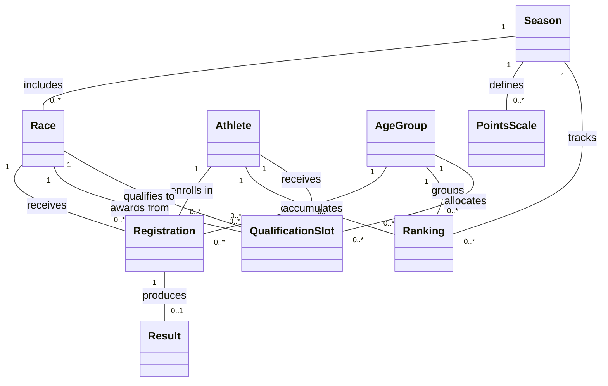

# IRONMAN Domain Model

## Initial Conceptual Model (reduced — no attributes)

This model shows only **classes and relationships** (concepts and how they connect to each other).

> **Note:** `Registration` is an intermediate class that resolves the many-to-many between `Athlete` and `Race`. It also holds the `AgeGroup` assignment, since the age-group depends on the athlete's age *at race date*, not globally. Similarly, `Ranking` is an intermediate class that resolves the Athlete-AgeGroup-Season accumulation. `QualificationSlot` has two relationships to `Race`: one for the qualifying race ("awards from") and one for the target championship ("qualifies to").

The two most relevant concepts are **Registration** and **Result**: Registration is the central association that connects athletes to races and determines their age-group category, while Result captures the actual performance data (segment times, positions) that drives the entire points and ranking system.

---

## Extended Conceptual Model (with attributes, types, and business rules)

The following business rules from the formulation are captured in the model:

1. **Age-group assignment is per registration, not per athlete** — An athlete's age-group is determined by their date of birth relative to the race date, plus their sex. This is modeled by the `Registration → AgeGroup` relationship.
2. **Total time is derived** — `Result.totalTime` is the sum of all segment times (swim + T1 + bike + T2 + run). Marked as derived.
3. **Points are determined by position and season** — `PointsScale` maps each finishing position to a point value for a given season. `Result.pointsEarned` is looked up from `PointsScale` using the age-group position and the race's season.
4. **Ranking is an accumulation** — `Ranking.totalPoints` is the sum of all `pointsEarned` from an athlete's results within a season. `Ranking.rankPosition` is the ordinal position when ordering by total points within an age-group.
5. **Qualification slots link two races** — A `QualificationSlot` connects a qualifying race (type = QUALIFIER) to a target championship race (type = CHAMPIONSHIP), for a specific age-group and athlete.
6. **One registration, one result** — An athlete registers once per race and produces at most one result (may DNS/DNF with no result).
7. **Age-groups are defined by sex and age range** — Each `AgeGroup` has a label (e.g., "M25-29"), a minimum and maximum age, and a sex.
8. **Multiple distances supported** — Races can be of type sprint, olympic, half (70.3), or full IRONMAN, modeled via the `Distance` enumeration.

> **Derived attributes:** `Result.totalTime` (sum of segment times), `Result.pointsEarned` (looked up from `PointsScale` via age-group position + season), `Ranking.totalPoints` (sum of `pointsEarned` across season), `Ranking.rankPosition` (ordinal by total points within age-group).

| Type | Why it is relevant |
|---|---|
| **`Distance`** (enum) | Defines the race format — each distance implies different segment lengths (e.g., full = 3.8km swim / 180km bike / 42.2km run). Critical for categorizing races and potentially differentiating point values. |
| **`RaceType`** (enum) | Distinguishes regular races from qualifiers and championships. This drives the qualification slot logic — only QUALIFIER races award slots, and only CHAMPIONSHIP races receive them. |

---

## Explicit Assumptions

- **Age-group is computed per registration, not stored on the athlete.** An athlete's age changes over time, so their age-group may differ between races in the same season. The AgeGroup is assigned at registration time based on DOB and race date.
- **Points scale is uniform within a season.** All races in a season use the same position-to-points mapping. There is no differentiation by distance or race type for points — this is the "simplified" scheme agreed upon.
- **An athlete can only register once per race.** The (Athlete, Race) pair is unique in Registration.
- **A result may not exist for a registration.** Athletes who DNS (Did Not Start) or were disqualified before finishing have a Registration but no Result.
- **QualificationSlot is awarded post-race.** Slots are assigned after results are recorded, to the top finishers in each age-group at qualifying races.
- **The target championship of a QualificationSlot is itself a Race** (with RaceType = CHAMPIONSHIP). This avoids creating a separate "WorldChampionship" entity.
- **Ranking is materialized, not just a view.** While totalPoints could be computed on the fly via SQL, it is modeled as an explicit entity to represent the official published ranking per season.
- **Country/nationality is stored as a String**, not as a separate entity. This simplification avoids an extra lookup table for what is essentially reference data.
- **Transitions (T1, T2) are separate time fields**, not their own entities. This matches how IRONMAN reports results (5 time splits per athlete).
