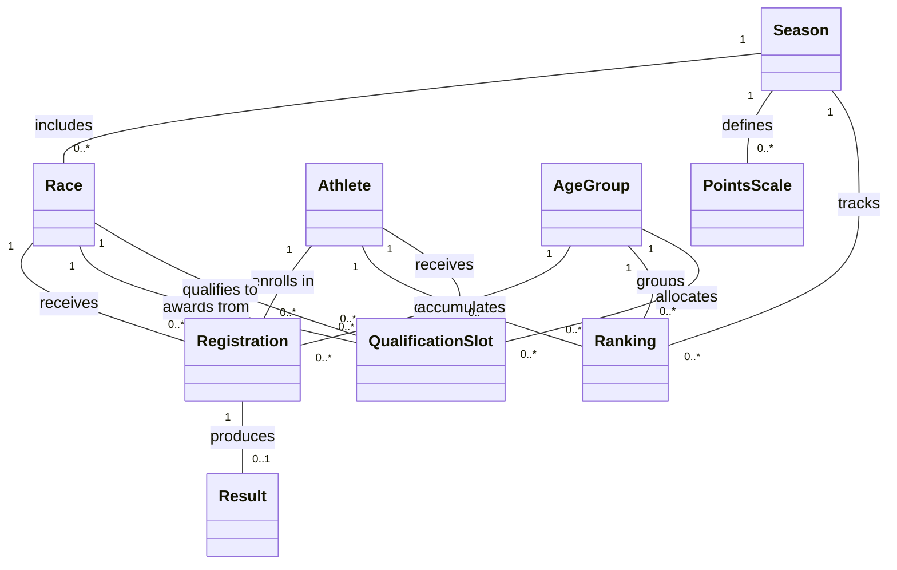
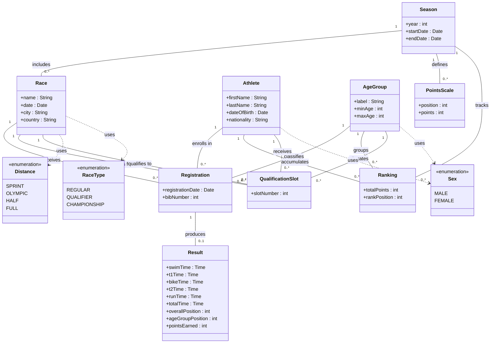

# IRONMAN Domain Model

## Initial Conceptual Model (reduced — no attributes)

This model shows only **classes and relationships** (concepts and how they connect to each other).

> **Note:** `Registration` is an intermediate class that resolves the many-to-many between `Athlete` and `Race`. It also holds the `AgeGroup` assignment, since the age-group depends on the athlete's age *at race date*, not globally. Similarly, `Ranking` is an intermediate class that resolves the Athlete-AgeGroup-Season accumulation. `QualificationSlot` has two relationships to `Race`: one for the qualifying race ("awards from") and one for the target championship ("qualifies to").

The two most relevant concepts are **Registration** and **Result**: Registration is the central association that connects athletes to races and determines their age-group category, while Result captures the actual performance data (segment times, positions) that drives the entire points and ranking system.

---

## Extended Conceptual Model (with attributes, types, and business rules)

The following business rules from the formulation are captured in the model:

1. **Age-group assignment is per registration, not per athlete** — An athlete's age-group is determined by their date of birth relative to the race date, plus their sex. This is modeled by the `Registration → AgeGroup` relationship.
2. **Total time is derived** — `Result.totalTime` is the sum of all segment times (swim + T1 + bike + T2 + run). Marked as derived.
3. **Points are determined by position and season** — `PointsScale` maps each finishing position to a point value for a given season. `Result.pointsEarned` is looked up from `PointsScale` using the age-group position and the race's season.
4. **Ranking is an accumulation** — `Ranking.totalPoints` is the sum of all `pointsEarned` from an athlete's results within a season. `Ranking.rankPosition` is the ordinal position when ordering by total points within an age-group.
5. **Qualification slots link two races** — A `QualificationSlot` connects a qualifying race (type = QUALIFIER) to a target championship race (type = CHAMPIONSHIP), for a specific age-group and athlete.
6. **One registration, one result** — An athlete registers once per race and produces at most one result (may DNS/DNF with no result).
7. **Age-groups are defined by sex and age range** — Each `AgeGroup` has a label (e.g., "M25-29"), a minimum and maximum age, and a sex.
8. **Multiple distances supported** — Races can be of type sprint, olympic, half (70.3), or full IRONMAN, modeled via the `Distance` enumeration.

> **Derived attributes:** `Result.totalTime` (sum of segment times), `Result.pointsEarned` (looked up from `PointsScale` via age-group position + season), `Ranking.totalPoints` (sum of `pointsEarned` across season), `Ranking.rankPosition` (ordinal by total points within age-group).

| Type | Why it is relevant |
|---|---|
| **`Distance`** (enum) | Defines the race format — each distance implies different segment lengths (e.g., full = 3.8km swim / 180km bike / 42.2km run). Critical for categorizing races and potentially differentiating point values. |
| **`RaceType`** (enum) | Distinguishes regular races from qualifiers and championships. This drives the qualification slot logic — only QUALIFIER races award slots, and only CHAMPIONSHIP races receive them. |

---

## Strategic CEO Queries — Business Intelligence for Decision-Making

The following queries are designed for the **CEO / executive leadership** of IRONMAN. Each one extracts actionable insights from the database to support strategic decisions about growth, athlete engagement, geographic expansion, and event optimization.

---

### Q1. Year-over-Year Growth by Distance Format

> **Decision it enables:** *Which race formats are growing and which are stagnating? Should we invest in more HALF (70.3) events or double down on FULL distance?*

**What the CEO sees:** A table showing how each distance format performs year over year — total races offered, total registrations, and average athletes per race. This reveals whether SPRINT attracts new athletes, whether FULL is saturating, and where the average participation per event is rising or falling.

---

### Q2. Top 10 Countries by Athlete Volume — Geographic Expansion Opportunities

> **Decision it enables:** *Where is our athlete base concentrated, and which emerging markets should we target for new events?*

**What the CEO sees:** The top 10 countries ranked by athlete count, alongside a loyalty metric (races per athlete). A country with many athletes but low races-per-athlete signals an underserved market needing more local events.

---

### Q3. Athlete Retention — Repeat Participation Across Seasons

> **Decision it enables:** *Are we retaining athletes season over season, or are we dependent on one-time participants?*

**What the CEO sees:** A year-by-year retention rate showing active athletes, returning athletes from the previous season, and the retention percentage. If only 30% of athletes return, the business is heavily acquisition-dependent — a signal to invest in loyalty programs or progressive race paths (SPRINT → OLYMPIC → HALF → FULL).

---

### Q4. Qualification Slot Demand vs. Supply — Championship Access Bottleneck

> **Decision it enables:** *Are there enough qualification slots relative to demand? Which age groups are underserved?*

**What the CEO sees:** The ratio of athletes competing for each qualification slot, broken down by age group and sex. An "athletes per slot" of 50:1 in M30-34 versus 5:1 in M60-64 reveals where demand vastly outstrips supply — an opportunity to add championship slots or more qualifying events for high-demand groups.

---

### Q5. Race Performance by City — Where to Expand or Cut

> **Decision it enables:** *Which host cities deliver the highest participation? Which events should be discontinued or relocated?*

**What the CEO sees:** A city-by-city scorecard showing editions held, total athletes across all editions, average athletes per edition, and average finish rate. Low average attendance or declining finish rates may indicate logistical problems, poor course conditions, or market saturation — actionable data for event portfolio decisions.

---

### Q6. Gender Participation Gap Analysis

> **Decision it enables:** *How balanced is our gender participation? Where should we invest in women-targeted marketing or programs?*

**What the CEO sees:** The male/female participation split for each distance format, per year, shown as both absolute count and percentage. If FULL distance is 85% male but SPRINT is 60/40, that suggests the shorter formats are a better gateway for women — informing targeted acquisition campaigns and event design.

---

### Q7. Elite vs. Age-Group Performance Trends — Points Inflation Check

> **Decision it enables:** *Is the points system working correctly, or is points inflation diluting the ranking's value?*

**What the CEO sees:** Average, maximum, minimum, and standard deviation of points earned per age group across seasons. If average points are climbing uniformly, the points scale might need recalibration. High standard deviations within a group indicate competitive balance; low stddev suggests the ranking is too flat.

---

### Q8. DNF/DNS Rate by Distance — Athlete Experience & Safety Indicator

> **Decision it enables:** *Are certain race distances causing too many dropouts? Is there a safety or course-design issue?*

**What the CEO sees:** Total registrations, finishers, DNF/DNS count, and dropout rate per distance format. A FULL distance DNF rate of 15% versus 3% for SPRINT is expected — but if any format suddenly spikes, it could signal course problems, inadequate athlete preparation, or extreme weather events worth investigating.

---

### Q9. Championship Qualification Pipeline — Conversion Funnel

> **Decision it enables:** *Of all athletes who compete in qualifiers, how many actually earn a slot? Is the qualification path motivating or discouraging participation?*

**What the CEO sees:** A year-by-year funnel showing athletes who competed in qualifiers, athletes who earned a slot, and the qualification conversion rate. If only 2% qualify, the path might feel unattainable — prompting the CEO to consider adding slots, creating tiered championships, or introducing a legacy qualification program.

---

### Q10. Multi-Race Athletes — High-Value Customer Identification

> **Decision it enables:** *Who are our most engaged athletes? Can we build VIP programs, sponsorship pipelines, or ambassador networks around them?*

**What the CEO sees:** The top 20 most active athletes (3+ races) with their full engagement profile: name, nationality, races entered, distinct distances tried, qualification slots won, and best ranking position. These are the brand ambassadors, the repeat customers, the athletes who should receive VIP treatment — and whose feedback is most valuable for product decisions.

---

## Explicit Assumptions

- **Age-group is computed per registration, not stored on the athlete.** An athlete's age changes over time, so their age-group may differ between races in the same season. The AgeGroup is assigned at registration time based on DOB and race date.
- **Points scale is uniform within a season.** All races in a season use the same position-to-points mapping. There is no differentiation by distance or race type for points — this is the "simplified" scheme agreed upon.
- **An athlete can only register once per race.** The (Athlete, Race) pair is unique in Registration.
- **A result may not exist for a registration.** Athletes who DNS (Did Not Start) or were disqualified before finishing have a Registration but no Result.
- **QualificationSlot is awarded post-race.** Slots are assigned after results are recorded, to the top finishers in each age-group at qualifying races.
- **The target championship of a QualificationSlot is itself a Race** (with RaceType = CHAMPIONSHIP). This avoids creating a separate "WorldChampionship" entity.
- **Ranking is materialized, not just a view.** While totalPoints could be computed on the fly via SQL, it is modeled as an explicit entity to represent the official published ranking per season.
- **Country/nationality is stored as a String**, not as a separate entity. This simplification avoids an extra lookup table for what is essentially reference data.
- **Transitions (T1, T2) are separate time fields**, not their own entities. This matches how IRONMAN reports results (5 time splits per athlete).
